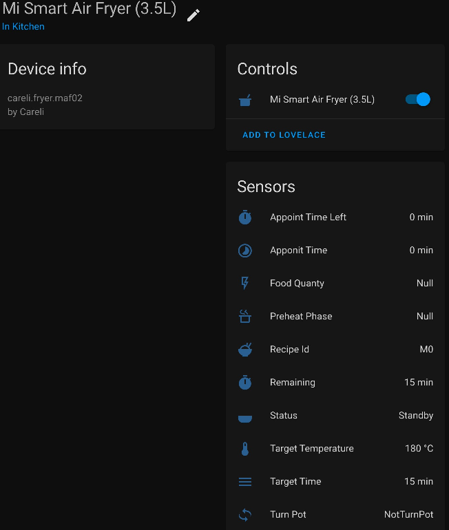
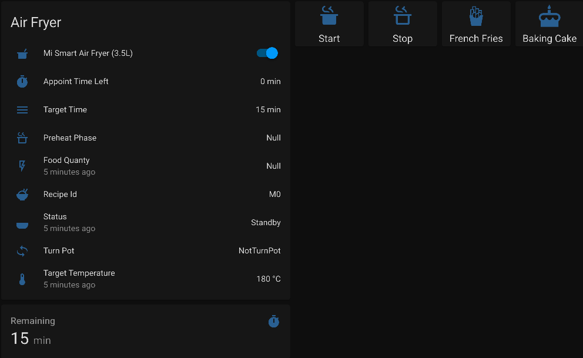
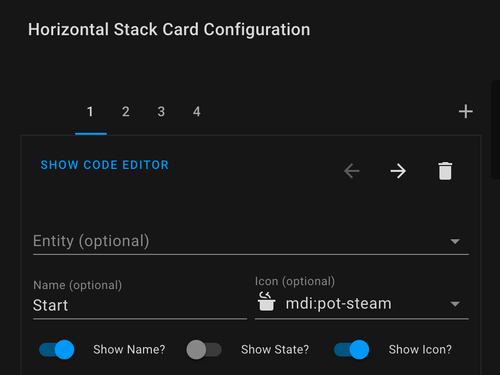

# Xiaomi AirFryer

[](https://www.buymeacoffee.com/tsunglung)

This is a custom component for home assistant to integrate the Xiaomi AirFryer.

Credits: Thanks to [Rytilahti](https://github.com/rytilahti/python-miio) for all the work.

## Supported devices

| Name                        | Model                  | Model no. |
|  -------------------------  | ---------------------- | --------- |
|                             | careli.fryer.maf01  |   |
| Mi Smart Air Fryer          | careli.fryer.maf02  |   |
|                             | careli.fryer.maf03  | |
|                             | careli.fryer.maf05a  | |
|                             | careli.fryer.maf10a  | |
|                             | careli.fryer.maf07  | |
| Upany Air Fryer YB-02208DTW | careli.fryer.ybaf01 | |
| Silencare AirFryer 1.8L     | silen.fryer.sck501  |   |
| Silencare AirFryer          | silen.fryer.sck505  | |

## Features

### Mi Smart Air Fryer

* Start cooking
* Start cooking with custom mode
* Stop cooking
* Set Recipe ID
* Pause cooking
* Resume cooking
* Set Appoint Time
* Sensors
  - status
  - target_time
  - target_temperature
  - left_time
  - rice_id (available while cooking)
  - work_time (available while cooking)
  - work_temp (available while cooking)
  - appoint_time (available while cooking)
  - food_quanty (available while cooking)
  - preheat_switch (available while cooking)
  - appoint_time_left (available while cooking)
  - turn_pot (available while cooking)
* Switches
  -  Start/Stop
* Services
  - TODO: child lock


## Install

You can install component with [HACS](https://hacs.xyz/) custom repo: HACS > Integrations > 3 dots (upper top corner) > Custom repositories > URL: `tsunglung/XiaomiAirFryer` > Category: Integration

Or manually copy `xiaomi_airfryer` folder to `custom_components` folder in your config folder.

Then restart HA.

## Setup


1. With GUI. Configuration > Integration > Add Integration > Xiaomi AirFryer
   1. If the integration didn't show up in the list please REFRESH the page
   2. If the integration is still not in the list, you need to clear the browser cache.
2. Enter your Xiaomi Account and Password
3. Select the AirFryer device that you want to integrate.

Or you also can manually input AirFryer IP address and token

If everything is configured correctly, Home Assistant’s Configuration - Devices list should have a device "AirFryer" and will show the following entities.


## Lovelace

```
type: vertical-stack
cards:
  - type: entities
    title: Air Fryer
    state_color: false
    entities:
      - entity: switch.xiaomi_airfryer_mi_smart_air_fryer_3_5l
      - entity: sensor.xiaomi_airfryer_appoint_time_left
      - entity: sensor.xiaomi_airfryer_target_time
      - entity: sensor.xiaomi_airfryer_preheat_phase
      - entity: sensor.xiaomi_airfryer_food_quanty
        secondary_info: last-changed
      - entity: sensor.xiaomi_airfryer_recipe_id
      - entity: sensor.xiaomi_airfryer_status
        secondary_info: last-changed
      - entity: sensor.xiaomi_airfryer_turn_pot
      - entity: sensor.xiaomi_airfryer_target_temperature
        secondary_info: last-changed
  - type: sensor
    entity: sensor.xiaomi_airfryer_remaining
    detail: 2
    hours_to_show: 1

```



If you prefer a button instead of a switch entity you could add a lovelace button card to you dashboard:

```
type: horizontal-stack
cards:
  - type: button
    tap_action:
      action: call-service
      service: xiaomi_airfryer.start
      service_data:
        entity_id: switch.xiaomi_airfryer_mi_smart_air_fryer_3_5l
      target: {}
    hold_action:
      action: more-info
    show_icon: true
    show_name: true
    icon: mdi:pot-steam
    name: Start
    icon_height: 40px
  - type: button
    tap_action:
      action: call-service
      service: xiaomi_airfryer.stop
      service_data:
        entity_id: switch.xiaomi_airfryer_mi_smart_air_fryer_3_5l
      target: {}
    hold_action:
      action: more-info
    show_icon: true
    show_name: true
    icon: mdi:pot-steam-outline
    name: Stop
    icon_height: 40px
  - type: button
    tap_action:
      action: call-service
      service: xiaomi_airfryer.recipe_id
      service_data:
        entity_id: switch.xiaomi_airfryer_mi_smart_air_fryer_3_5l
        recipe_id: M1
      target: {}
    hold_action:
      action: more-info
    show_icon: true
    show_name: true
    icon: mdi:french-fries
    name: French Fries
    icon_height: 40px
  - type: button
    tap_action:
      action: call-service
      service: xiaomi_airfryer.recipe_id
      service_data:
        entity_id: switch.xiaomi_airfryer_mi_smart_air_fryer_3_5l
        recipe_id: M7
      target: {}
    hold_action:
      action: more-info
    show_icon: true
    show_name: true
    icon: mdi:cake
    name: Baking Cake
    icon_height: 40px
```



## Debugging

If the custom component doesn't work out of the box for your device please update your configuration to increase the log level:

```
logger:
  default: warn
  logs:
    custom_components.xiaomi_airfryer: debug
    miio: debug
```

## Platform services

#### Service `xiaomi_airfryer.start_custom`

Start cooking with mode.

| Service data attribute    | Optional | Description                                                          |
|---------------------------|----------|----------------------------------------------------------------------|
| `mode`                 |       no | Mode data .                  |

#### Service `xiaomi_airfryer.start`

Start the cooking process.

#### Service `xiaomi_airfryer.stop`

Stop the cooking process.

#### Service `xiaomi_airfryer.pause`

Pause the cooking process.

#### Service `xiaomi_airfryer.resume`

Resume the cooking process.

#### Service `xiaomi_airfryer.appoint_time`

Start appoint cooking time.

| Service data attribute    | Optional | Description                                                          |
|---------------------------|----------|----------------------------------------------------------------------|
| `time`                 |       no | Time data .                  |

#### Service `xiaomi_airfryer.recipe_id`

Start cooking recipe id.

| Service data attribute    | Optional | Description                                                          |
|---------------------------|----------|----------------------------------------------------------------------|
| `recipe_id`                 |       no | Recipe ID data .                  |

#### Service `xiaomi_airfryer.food_quanty`

Start cooking food quanty.

| Service data attribute    | Optional | Description                                                          |
|---------------------------|----------|----------------------------------------------------------------------|
| `food_quanty`                 |       no | Food Quanty data .                  |

#### Service `xiaomi_airfryer.target_time`

Start cooking target time.

| Service data attribute    | Optional | Description                                                          |
|---------------------------|----------|----------------------------------------------------------------------|
| `target_time`                 |       no | Target Time data .                  |

#### Service `xiaomi_airfryer.target_temperature`

Start cooking target temperature.

| Service data attribute    | Optional | Description                                                          |
|---------------------------|----------|----------------------------------------------------------------------|
| `target_temperature`      |       no | Target Temperature data .                  |


Buy me a Coffee

|  LINE Pay | LINE Bank | JKao Pay |
| :------------: | :------------: | :------------: |
|| | |
